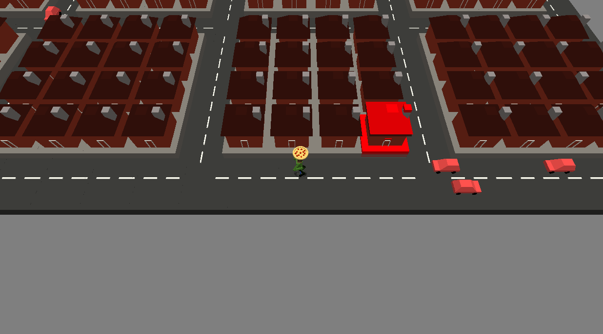

# Pizza Delivery

Author: Alton Olson

Design: You unicycle around a small city delivering pizzas (that you find on the street) to hungry customers, while trying not to get hit by traffic.

Screen Shot:

How To Play:

WASD to move. The house you're delivering to is highlighted in red. When multiple cars reach an intersection, they treat it as a 4-way stop. The cars will not stop for you though, so be careful.

Sources: I made everything from scratch in blender.

This game was built with [NEST](NEST.md).

